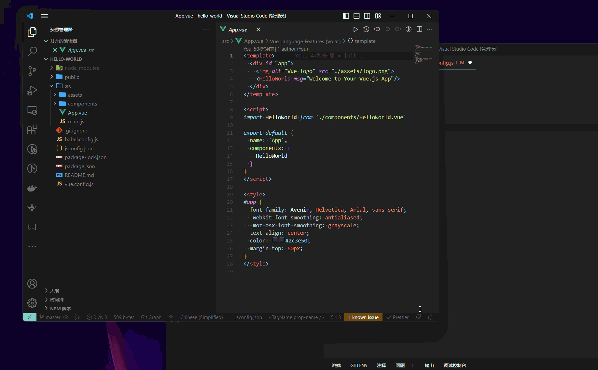

##### 效果

## 安装
Node 版本: v.16 

## 使用
1. `npm i` 安装依赖

2. 更改扫描路径: `config/config.js`
    #### 需要扫描的路径
    例如：
    ```js
    {
        "paths": [
            <!-- unix 路径写法 -->
           "user\code\xxx1\src",
           "user\code\xxx2\src",
           "user\code\xxx3\src",
            <!-- window 路径写法 -->
           "D://code//xxx1//src",
           "D://code//xxx2//src",
           "D://code//xxx3//src",
        ]
    }
    ```

    具体路径文件集合在config中。

3. `node main.js` 


## 使用文档(持续更新)

[Link Text](./funcitonal.md)


## 输出 
文件夹: `output/`
1. `js_imports_output.yml` 主要输出依赖的js文件

2. `vue_output.yml` 主要输出依赖的vue文件


文件夹: `error_log/` （可忽略）
1. `error_log.yml` 主要用于记录 js解析到其他内容无法解析的内容

